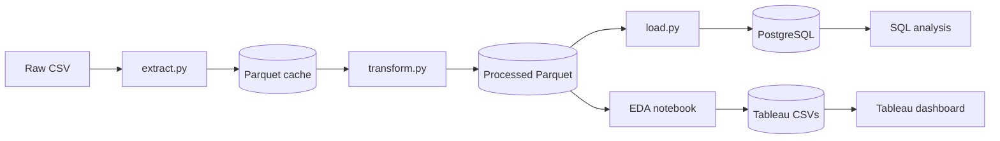
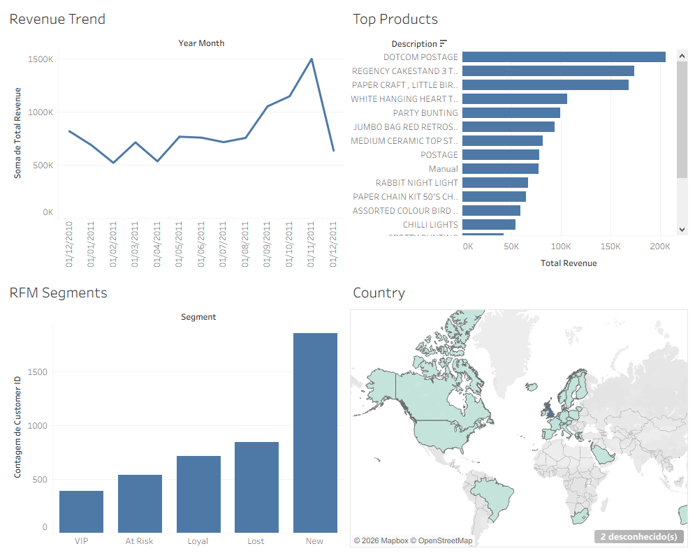

<div align="center">

# 📊 Global Retail Pulse
### Transforme dados brutos de vendas em decisões de negócio.

[](https://python.org)
[](https://postgresql.org)
[](https://pandas.pydata.org)
[](https://jupyter.org)
[](LICENSE)

**[🇧🇷 Português](#versão-em-português)** • **[🇺🇸 English](#english-version)**

</div>

---

# VERSÃO EM PORTUGUÊS

# Global Retail Pulse — Análise de Vendas e Clientes E-commerce

*Pipeline completo de dados brutos → PostgreSQL → EDA → dashboard Tableau.*

## Visão Geral do Projeto

O Global Retail Pulse analisa 13 meses de dados transacionais (dezembro de 2010 a dezembro de 2011) de um varejista de e-commerce do Reino Unido especializado em artigos de presente. O objetivo é transformar registros brutos de vendas em insights de negócio acionáveis sobre receita, produtos, clientes e mercados — o tipo de análise que sustentaria decisões reais de precificação, gestão de estoque e marketing de retenção. O pipeline cobre o ciclo completo: ingestão e limpeza em Python, armazenamento estruturado em PostgreSQL, análise exploratória em Jupyter e visualização final em um dashboard Tableau Public.

## Principais Achados

- **Sazonalidade de Q4** — a receita atinge o pico no quarto trimestre, com novembro de 2011 sendo o mês de maior faturamento de todo o período analisado — um padrão sazonal claramente ligado às compras de fim de ano.
- **Concentração em poucos produtos** — os 10 produtos mais vendidos concentram uma parcela desproporcional da receita total; DOTCOM POSTAGE e REGENCY CAKESTAND 3 TIER lideram com folga, seguidos por PAPER CRAFT LITTLE BIRDIE.
- **Concentração de receita em poucos clientes** — o cliente 14646, sozinho, gerou mais de £280.000 em receita, evidenciando um risco claro de retenção caso esse cliente VIP deixe de comprar.
- **540 clientes "At Risk"** — a segmentação RFM identifica 540 clientes com gasto histórico relevante, mas sem compras recentes — uma oportunidade prioritária de campanhas de reativação.
- **Reino Unido domina, mas há espaço para expansão** — o Reino Unido responde pela grande maioria da receita; mercados secundários como Holanda, Irlanda, Alemanha e França já geram receita, mas em volume ainda pequeno, um indício de potencial de expansão internacional.

RFM segmentada em 4.338 clientes conhecidos (excluindo checkouts sem identificação):

| Segmento | Clientes |
|---|---:|
| New | 1.853 |
| Lost | 843 |
| Loyal | 711 |
| At Risk | 540 |
| VIP | 391 |

## Arquitetura

O pipeline segue um fluxo linear de ETL, com duas saídas de análise: consultas SQL direto no PostgreSQL, e um notebook de EDA que gera os CSVs consumidos pelo dashboard Tableau.



Detalhes por arquivo e dependências estão em [`docs/architecture.md`](docs/architecture.md).

## Tech Stack

| Camada | Ferramenta |
|---|---|
| Ingestão | Python + pandas (`extract.py`) |
| Armazenamento | PostgreSQL 15 |
| Transformação | pandas — limpeza, segmentação RFM, agregados mensais (`transform.py`) |
| Análise SQL | Arquivos `.sql` puros, executados via psycopg2 (`sql/analysis_queries.sql`) |
| Visualização | Jupyter + Matplotlib/Seaborn (EDA) → Tableau Public (dashboard) |
| Controle de Versão | Git |
| Linguagem | Python 3.13 |

## Dataset

Este projeto usa o **Online Retail II**, um dataset público de transações de e-commerce de um varejista de presentes do Reino Unido, publicado pelo UCI Machine Learning Repository (também espelhado no Kaggle). O pipeline foi construído especificamente para o recorte de dezembro de 2010 a dezembro de 2011.

**Como baixar:**
- **UCI ML Repository** — [archive.ics.uci.edu/dataset/502/online+retail+ii](https://archive.ics.uci.edu/dataset/502/online+retail+ii). Baixe o arquivo e exporte/salve a planilha referente ao período 2010–2011 em formato CSV.
- **Kaggle** — busque por "Online Retail II" (é necessário login gratuito) e baixe o CSV equivalente ao mesmo período.

**Onde colocar:**

```
data/raw/online_retail_II.csv
```

O arquivo deve conter as colunas `Invoice`, `StockCode`, `Description`, `Quantity`, `InvoiceDate`, `Price`, `Customer ID` e `Country`, com `InvoiceDate` no formato `M/D/YY H:MM`. O diretório `data/raw/` é ignorado pelo Git — apenas o `.gitkeep` é versionado.

**Qualidade dos dados:** das 541.910 linhas brutas, 524.878 permanecem após a limpeza feita em `transform.py` — 17.032 linhas removidas (9.288 pedidos cancelados, 1.336 com quantidade ≤ 0, 1.181 com preço ≤ 0 e 5.227 duplicatas).

## Setup Local

### 1. Clonar o repositório

```bash
git clone https://github.com/gutsfz/global-retail-pulse.git
cd global-retail-pulse
```

### 2. Baixar o dataset

Siga as instruções da seção **Dataset** acima e salve o arquivo em `data/raw/online_retail_II.csv`.

### 3. Criar e ativar o virtual environment

```powershell
python -m venv venv
.\venv\Scripts\Activate.ps1
```

> Se o PowerShell bloquear a execução do script, rode: `Set-ExecutionPolicy -ExecutionPolicy RemoteSigned -Scope CurrentUser`

### 4. Instalar as dependências

```bash
pip install -r requirements.txt
```

### 5. Configurar o PostgreSQL

Crie o banco de dados e um usuário dedicado:

```powershell
psql -U postgres
```

```sql
CREATE DATABASE global_retail_pulse;
CREATE USER grp_user WITH PASSWORD 'sua_senha_forte';
GRANT ALL PRIVILEGES ON DATABASE global_retail_pulse TO grp_user;
\q
```

### 6. Configurar as variáveis de ambiente

Copie o arquivo de exemplo e preencha suas credenciais:

```bash
copy .env.example .env
```

```env
DB_HOST=localhost
DB_PORT=5432
DB_NAME=global_retail_pulse
DB_USER=grp_user
DB_PASSWORD=sua_senha_forte
```

> `.env` está no `.gitignore` e nunca é commitado — apenas o `.env.example` (com valores de exemplo) é versionado.

### 7. Testar a conexão

```bash
python -c "
import psycopg2, os
from dotenv import load_dotenv
load_dotenv()
conn = psycopg2.connect(
    host=os.getenv('DB_HOST'),
    port=os.getenv('DB_PORT'),
    dbname=os.getenv('DB_NAME'),
    user=os.getenv('DB_USER'),
    password=os.getenv('DB_PASSWORD'),
)
print('Connection successful:', conn.get_dsn_parameters())
conn.close()
"
```

> **Alternativa com SQLite:** se configurar o PostgreSQL não for viável no seu ambiente, note que toda a lógica de conexão está centralizada em `src/db.py` — trocar o backend para SQLite exigiria adaptar apenas essa função (e os tipos em `sql/schema.sql`), sem tocar em `extract.py` ou `transform.py`.

## Como Rodar

Com o virtual environment ativo, execute os passos abaixo a partir da raiz do projeto, nesta ordem:

```bash
python src/extract.py
python src/transform.py
psql -U grp_user -d global_retail_pulse -f sql/schema.sql
python src/load.py
jupyter notebook
```

- `extract.py` lê o CSV bruto e grava um cache em Parquet.
- `transform.py` limpa os dados e calcula receita, agregados mensais e segmentação RFM.
- `schema.sql` (re)cria as tabelas `orders`, `monthly_aggregates` e `rfm` no PostgreSQL.
- `load.py` carrega os Parquets processados nessas tabelas.
- `jupyter notebook` abre o Jupyter para rodar `notebooks/01_exploratory_analysis.ipynb`, que gera os gráficos de EDA e exporta os CSVs usados no dashboard Tableau.

> Rode todos os comandos a partir da raiz do repositório, com o `venv` ativo.

## Dashboard



O passo a passo completo de construção do dashboard — fontes de dados, planilhas e instruções de publicação — está documentado em [`dashboard/README.md`](dashboard/README.md).

## Licença

Este projeto está licenciado sob a licença MIT — veja o arquivo [LICENSE](LICENSE) para o texto completo.

---

# ENGLISH VERSION

# Global Retail Pulse — E-commerce Sales & Customer Analytics

*End-to-end pipeline: raw data → PostgreSQL → EDA → Tableau dashboard.*

## Project Overview

Global Retail Pulse analyses 13 months of transactional data (December 2010 to December 2011) from a UK-based e-commerce retailer specialising in giftware. The goal is to turn raw sales records into actionable business insights around revenue, products, customers, and markets — the kind of analysis that could realistically support pricing, inventory management, and retention-marketing decisions. The pipeline covers the full lifecycle: ingestion and cleaning in Python, structured storage in PostgreSQL, exploratory analysis in Jupyter, and final visualisation in a Tableau Public dashboard.

## Key Findings

- **Q4 seasonality** — revenue peaks in the fourth quarter, with November 2011 as the single highest-revenue month in the entire analysed period — a clear seasonal pattern tied to the holiday shopping season.
- **Product concentration** — the top 10 products account for a disproportionate share of total revenue; DOTCOM POSTAGE and REGENCY CAKESTAND 3 TIER lead by a wide margin, followed by PAPER CRAFT LITTLE BIRDIE.
- **Revenue concentrated in a handful of customers** — customer 14646 alone generated over £280,000 in revenue, a clear VIP retention risk if that single account were to churn.
- **540 "At Risk" customers** — RFM segmentation flags 540 customers with meaningful historical spend but no recent purchases — a priority target for reactivation campaigns.
- **UK-dominant, with room to expand** — the United Kingdom accounts for the vast majority of revenue; secondary markets such as the Netherlands, Ireland, Germany, and France already contribute revenue but at much smaller volumes, a signal of international expansion potential.

RFM segmentation across 4,338 known customers (guest checkouts excluded):

| Segment | Customers |
|---|---:|
| New | 1,853 |
| Lost | 843 |
| Loyal | 711 |
| At Risk | 540 |
| VIP | 391 |

## Architecture

The pipeline follows a linear ETL flow with two analysis exit points: SQL queries run directly against PostgreSQL, and an EDA notebook that produces the CSVs consumed by the Tableau dashboard.


Per-file breakdown and dependencies live in [`docs/architecture.md`](docs/architecture.md).

## Tech Stack

| Layer | Tool |
|---|---|
| Ingestion | Python + pandas (`extract.py`) |
| Storage | PostgreSQL 15 |
| Transformation | pandas — cleaning, RFM segmentation, monthly aggregates (`transform.py`) |
| SQL Analysis | Plain `.sql` files, executed via psycopg2 (`sql/analysis_queries.sql`) |
| Visualisation | Jupyter + Matplotlib/Seaborn (EDA) → Tableau Public (dashboard) |
| Version Control | Git |
| Language | Python 3.13 |

## Dataset

This project uses **Online Retail II**, a public e-commerce transaction dataset from a UK-based giftware retailer, published by the UCI Machine Learning Repository (also mirrored on Kaggle). The pipeline was built specifically for the December 2010 – December 2011 slice.

**How to download:**
- **UCI ML Repository** — [archive.ics.uci.edu/dataset/502/online+retail+ii](https://archive.ics.uci.edu/dataset/502/online+retail+ii). Download the file and export/save the 2010–2011 sheet as CSV.
- **Kaggle** — search for "Online Retail II" (a free account is required) and download the CSV covering the same period.

**Where to place it:**

```
data/raw/online_retail_II.csv
```

The file must contain the columns `Invoice`, `StockCode`, `Description`, `Quantity`, `InvoiceDate`, `Price`, `Customer ID`, and `Country`, with `InvoiceDate` formatted as `M/D/YY H:MM`. The `data/raw/` directory is git-ignored — only the `.gitkeep` placeholder is tracked.

**Data quality:** of the 541,910 raw rows, 524,878 remain after the cleaning performed in `transform.py` — 17,032 rows removed (9,288 cancelled orders, 1,336 with quantity ≤ 0, 1,181 with price ≤ 0, and 5,227 duplicates).

## Local Setup

### 1. Clone the repository

```bash
git clone https://github.com/gutsfz/global-retail-pulse.git
cd global-retail-pulse
```

### 2. Download the dataset

Follow the instructions in the **Dataset** section above and save the file to `data/raw/online_retail_II.csv`.

### 3. Create and activate the virtual environment

```powershell
python -m venv venv
.\venv\Scripts\Activate.ps1
```

> If PowerShell blocks script execution, run: `Set-ExecutionPolicy -ExecutionPolicy RemoteSigned -Scope CurrentUser`

### 4. Install dependencies

```bash
pip install -r requirements.txt
```

### 5. Configure PostgreSQL

Create the database and a dedicated user:

```powershell
psql -U postgres
```

```sql
CREATE DATABASE global_retail_pulse;
CREATE USER grp_user WITH PASSWORD 'your_strong_password';
GRANT ALL PRIVILEGES ON DATABASE global_retail_pulse TO grp_user;
\q
```

### 6. Configure environment variables

Copy the example file and fill in your credentials:

```bash
copy .env.example .env
```

```env
DB_HOST=localhost
DB_PORT=5432
DB_NAME=global_retail_pulse
DB_USER=grp_user
DB_PASSWORD=your_strong_password
```

> `.env` is listed in `.gitignore` and is never committed — only `.env.example` (with placeholder values) is tracked.

### 7. Test the connection

```bash
python -c "
import psycopg2, os
from dotenv import load_dotenv
load_dotenv()
conn = psycopg2.connect(
    host=os.getenv('DB_HOST'),
    port=os.getenv('DB_PORT'),
    dbname=os.getenv('DB_NAME'),
    user=os.getenv('DB_USER'),
    password=os.getenv('DB_PASSWORD'),
)
print('Connection successful:', conn.get_dsn_parameters())
conn.close()
"
```

> **SQLite alternative:** if setting up PostgreSQL isn't practical in your environment, note that all connection logic is centralized in `src/db.py` — swapping the backend to SQLite would only require adapting that one function (plus the column types in `sql/schema.sql`), leaving `extract.py` and `transform.py` untouched.

## How to Run

With the virtual environment active, run the steps below from the project root, in this order:

```bash
python src/extract.py
python src/transform.py
psql -U grp_user -d global_retail_pulse -f sql/schema.sql
python src/load.py
jupyter notebook
```

- `extract.py` reads the raw CSV and writes a Parquet cache.
- `transform.py` cleans the data and computes revenue, monthly aggregates, and RFM segmentation.
- `schema.sql` (re)creates the `orders`, `monthly_aggregates`, and `rfm` tables in PostgreSQL.
- `load.py` loads the processed Parquet files into those tables.
- `jupyter notebook` opens Jupyter to run `notebooks/01_exploratory_analysis.ipynb`, which produces the EDA charts and exports the CSVs used by the Tableau dashboard.

> Run all commands from the repository root with the `venv` active.

## Dashboard


The full dashboard build steps — data sources, sheets, and publishing instructions — are documented in [`dashboard/README.md`](dashboard/README.md).

## License

This project is licensed under the MIT License — see the [LICENSE](LICENSE) file for the full text.

---
