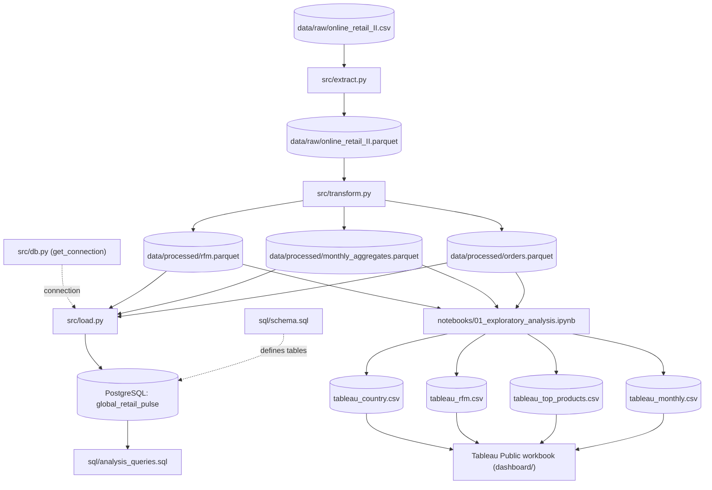

# Architecture — Global Retail Pulse

Global Retail Pulse is a linear, file-based ETL pipeline: each stage reads from a fixed path and writes to a fixed path, so any stage can be re-run independently as long as its upstream input already exists. Raw transaction data is cached as Parquet right after extraction, cleaned and enriched by a single transformation stage, and then split into two downstream paths — one loads into PostgreSQL for SQL-based analysis, the other feeds a Jupyter notebook that produces the CSV extracts consumed by the Tableau dashboard.

## Pipeline Diagram

## Components

| Component | Responsibility | Input | Output |
|---|---|---|---|
| `src/extract.py` | Load the raw CSV, parse invoice dates, validate expected columns, and cache the result as Parquet | `data/raw/online_retail_II.csv` | `data/raw/online_retail_II.parquet` |
| `src/transform.py` | Clean the raw data (drop cancellations, non-positive quantity/price, and duplicates; fill missing customer IDs with `"Guest"`), compute revenue, and build monthly aggregates + RFM segmentation | `data/raw/online_retail_II.parquet` | `data/processed/orders.parquet`, `data/processed/monthly_aggregates.parquet`, `data/processed/rfm.parquet` |
| `sql/schema.sql` | Define (and reset) the PostgreSQL table structure for `orders`, `monthly_aggregates`, and `rfm` | — (run manually via `psql`) | PostgreSQL tables in the `global_retail_pulse` database |
| `src/db.py` | Read DB credentials from `.env` and expose a reusable psycopg2 connection factory | Environment variables (`DB_HOST`, `DB_PORT`, `DB_NAME`, `DB_USER`, `DB_PASSWORD`) | `psycopg2` connection object |
| `src/load.py` | Truncate and bulk-insert the processed Parquet files into their corresponding PostgreSQL tables | `data/processed/*.parquet` + connection from `src/db.py` | Populated `orders`, `monthly_aggregates`, `rfm` tables |
| `sql/analysis_queries.sql` | Business-intelligence queries: revenue trend, top products, top customers, RFM distribution, country breakdown, VIP detail | PostgreSQL tables | Query result sets (ad hoc via `psql`) |
| `notebooks/01_exploratory_analysis.ipynb` | Explore the processed data, chart revenue/product/customer/segment/country trends, and export Tableau-ready summary CSVs | `data/processed/orders.parquet`, `monthly_aggregates.parquet`, `rfm.parquet` | Inline charts + `data/processed/tableau_*.csv` |
| `dashboard/` (Tableau Public) | Combine the 4 Tableau CSVs into an interactive published dashboard | `data/processed/tableau_*.csv` | Published Tableau Public workbook |
